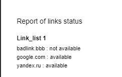

# Link Status Checker

Сервис принимает списки ссылок, проверяет их доступность и сохраняет результаты в локальное хранилище.  
Позволяет сформировать PDF-отчёт по ранее отправленным наборам.

## Запуск

```bash
go run ./cmd/app
```

## Endpoints

## POST /links

Проверяет ссылки, возвращает статусы и номер набора.
## Пример запроса:
```bash 
{
  "links": ["google.com", "yandex.ru"]
} 
```
## Пример ответа:
```bash 
{
  "links": {
    "https://google.com": "available",
    "https://yandex.ru": "available"
  },
  "links_num": 1
}
```

### POST /report

Возвращает PDF по списку ранее созданных наборов.

## Пример запрос:

```bash 
{
  "links_list": [1]
}
```

## Пример ответа в пдф: 


## Архитектура
* handler — HTTP слой
* service — бизнес-логика
* storage — сохранение данных в JSON
* pdf — генерация PDF
* models, dto — структуры данных
